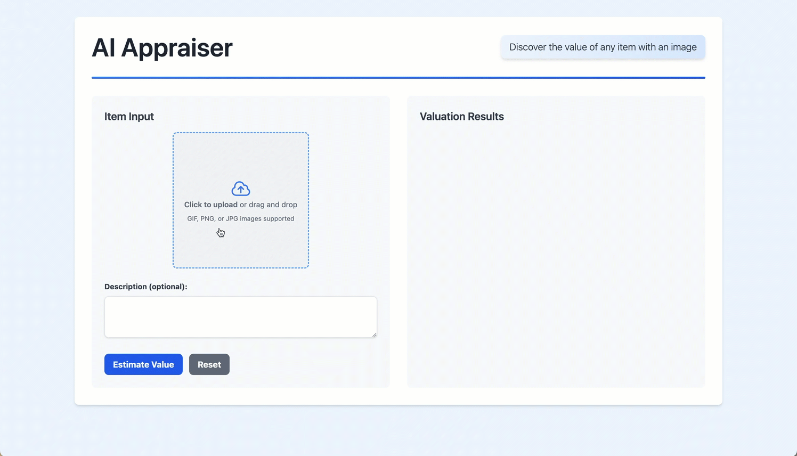

# AI Appraiser

[](https://github.com/kweinmeister/ai-appraiser/actions/workflows/python-tests.yml)



This application estimates the value of an item from an image. It leverages Google's [Gemini](https://ai.google.dev/gemini-api/docs) model with integrated [Grounding with Google Search](https://ai.google.dev/gemini-api/docs/grounding) capabilities to improve the accuracy of valuations.

This application is intended for informational purposes only and should not substitute for professional appraisals.

## Table of Contents

- [Features](#features)
- [Architecture](#architecture)
- [Prerequisites](#prerequisites)
- [Setup](#setup)
- [Running the Application](#running-the-application)
- [Testing](#testing)
- [Environment Variables](#environment-variables)

## Features

- **AI-powered valuation:** Get instant value estimates for your items using images and descriptions.
- **Grounded search:** Leverages Google's Gemini model with integrated search for recent pricing.
- **Image upload:** Supports GIF, PNG, and JPG images with a user-friendly interface.
- **Optional Cloud Storage:** Store images securely in Google Cloud Storage.

## Architecture

The AI Appraiser application follows a client-server architecture:

- **Frontend ([index.html](./index.html)):** The client-side interface built with HTML, Tailwind CSS, and HTMX. It handles user interactions, image uploads, and displays valuation results.
- **Backend ([main.py](./main.py)):** A FastAPI server that handles API requests. It interacts with Google Cloud Storage (optional) and the Gemini API for image processing and valuation.
- **Gemini API:** A powerful language model from Google that performs the core valuation logic, utilizing its built-in search tool for market data.

## Prerequisites

- Python 3.9+ with `pip`
- A Google Cloud project with billing enabled. and `Vertex AI` and `Cloud Storage` APIs enabled
- Set up Application Default Credentials (ADC) for your Google Cloud project. You can do this by running `gcloud auth application-default login` in your terminal.
- (Optional) If storing images in Google Cloud Storage, configure a Google Cloud service account with the necessary permissions (`storage.objects.create` and `storage.objects.get`). You can find instructions on creating and managing service accounts in the [Google Cloud documentation](https://cloud.google.com/iam/docs/service-accounts).

## Setup

1. **Clone the repository:**

    ```bash
    git clone https://github.com/kweinmeister/ai-appraiser
    cd ai-appraiser
    ```

2. **Install dependencies:**

    ```bash
    pip install -r requirements.txt
    ```

## Running the Application

1. **Set environment variables:**

    The application uses several environment variables for configuration. You can set them directly in your terminal or use a `.env` file. See the [Environment Variables](#environment-variables) section for details. At a minimum, you need to set `GOOGLE_CLOUD_PROJECT`. If you want to use image upload to GCS, you also need to set `CLOUD_STORAGE_BUCKET_NAME`.

2. **Run the application using Uvicorn:**

    ```bash
    uvicorn main:app --host 0.0.0.0 --port 8080
    ```

    The application will be accessible at `http://localhost:8080`.

## Deployment

You can easily deploy this application to Google Cloud Run:

```bash
gcloud run deploy ai-appraiser \
  --source . \
  --region $LOCATION \
  --allow-unauthenticated \
  --set-env-vars="GOOGLE_CLOUD_PROJECT=$GOOGLE_CLOUD_PROJECT,STORAGE_BUCKET=$STORAGE_BUCKET,MODEL_ID=$MODEL_ID"
```

Replace `$GOOGLE_CLOUD_PROJECT`, `$LOCATION`, `$STORAGE_BUCKET`, and `$MODEL_ID` with your actual values. This command will build the container image, push it to Container Registry, and deploy it to Cloud Run.

## Testing

To run the tests, use pytest:

```bash
pytest
```

The tests cover the core functionality of the application, including image upload, data URL generation, and valuation logic. They use mocking to simulate interactions with external services like Google Cloud Storage and the Gemini API.

## Environment Variables

- **`GOOGLE_CLOUD_PROJECT`**: (Required) Your Google Cloud project ID.
- **`LOCATION`**: (Optional) The Google Cloud region to use. Defaults to `us-central1`.
- **`MODEL_ID`**: (Optional) The ID of the Gemini model to use. Defaults to `gemini-2.0-flash-001`.
- **`STORAGE_BUCKET`**: (Optional) The name of your Google Cloud Storage bucket for image uploads. If not set, image uploads to GCS will be skipped.
